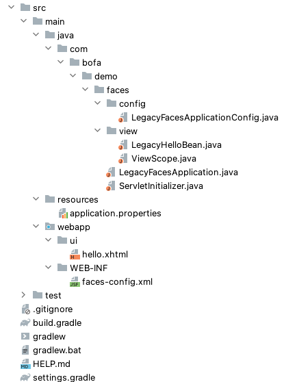

# Getting Started

### Reference Documentation
For further reference, please consider the following sections:

* [Official Gradle documentation](https://docs.gradle.org)
* [Spring Boot Gradle Plugin Reference Guide](https://docs.spring.io/spring-boot/docs/3.1.0/gradle-plugin/reference/html/)
* [Create an OCI image](https://docs.spring.io/spring-boot/docs/3.1.0/gradle-plugin/reference/html/#build-image)
* [Spring Web](https://docs.spring.io/spring-boot/docs/3.1.0/reference/htmlsingle/#web)

### Guides
The following guides illustrate how to use some features concretely:

* [Building a RESTful Web Service](https://spring.io/guides/gs/rest-service/)
* [Serving Web Content with Spring MVC](https://spring.io/guides/gs/serving-web-content/)
* [Building REST services with Spring](https://spring.io/guides/tutorials/rest/)

### Additional Links
These additional references should also help you:

* [Gradle Build Scans – insights for your project's build](https://scans.gradle.com#gradle)

  Step 1: Add an EL resolver entry in faces-config: SpringBeanFacesELResolver allows us to use JSF managed beans as Spring beans. 
  Step 2: Register FacesServlet and add/customize contex
  Step 3: Define Dependency. ...
  Step 4: Add Dependency. ...
  Step 5: Use Dependency.

JSF ELResolver that delegates to the Spring root WebApplicationContext, resolving name references to Spring-defined beans.

Configure this resolver in your faces-config.xml file as follows:

 <application>
   ...
   <el-resolver>org.springframework.web.jsf.el.SpringBeanFacesELResolver</el-resolver>
 </application>

All your JSF expressions can then implicitly refer to the names of Spring-managed service layer beans, for example in property values of JSF-managed beans:

As Spring lacks the JSF view scope, also a custom scope to emulate it.
If you are using JSF&Spring and decided upgrading to JSF 2.0, one thing you would probably like to have is the JSF 2.0’s built-in viewscope. Core Spring doesn’t provide this scope as it is more specific to JSF. No worries, using Spring’s custom scope feature it is straightforward to port JSF 2.0’s viewscope as a Spring bean scope.

  
